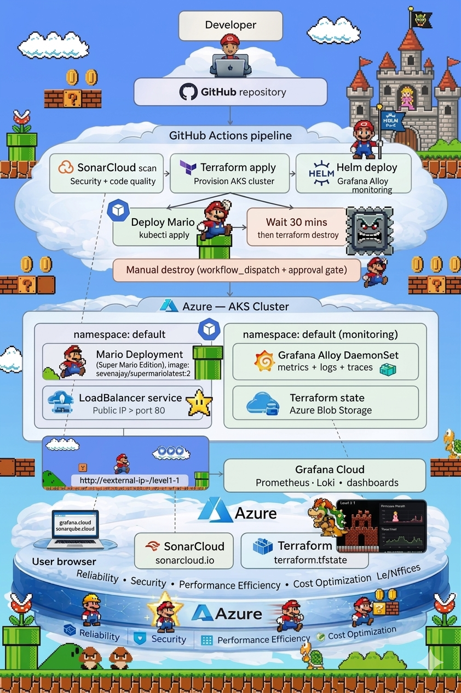

# Super Mario on Azure Kubernetes Service — DevSecOps Pipeline

A full end-to-end DevSecOps project deploying the Super Mario game on Azure Kubernetes Service (AKS) using Terraform, GitHub Actions, SonarCloud, and Grafana Alloy. The project demonstrates enterprise-grade cloud engineering practices including infrastructure as code, security scanning, observability, cost management, and automated lifecycle management.

[](https://kubernetes.io/)
[](https://azure.microsoft.com/en-us/products/kubernetes-service)
[](https://helm.sh/)
[](https://learn.microsoft.com/en-us/azure/virtual-machines/dpsv5-dpdsv5-series)
[](https://hub.docker.com/)

## Project Overview

This project was built to demonstrate real-world cloud and DevSecOps engineering skills across the full software delivery lifecycle — from infrastructure provisioning and security scanning to live monitoring and automated teardown. The application itself (Super Mario) is intentionally simple, allowing focus on the engineering and operational infrastructure that surrounds it.

The pipeline is triggered by a single `git push`, and from that moment it provisions a Kubernetes cluster on Azure, scans the codebase for security vulnerabilities, deploys the application, ships live telemetry to Grafana Cloud, and then destroys all infrastructure automatically after 30 minutes — demonstrating ephemeral infrastructure and cost-conscious cloud engineering.

---

## Objectives

- Design and implement a production-grade CI/CD pipeline using GitHub Actions
- Provision and manage cloud infrastructure using Terraform with remote state
- Implement DevSecOps practices using SonarCloud for static analysis and security scanning
- Deploy containerised applications to Azure Kubernetes Service
- Implement full-stack observability using Grafana Alloy, Prometheus, and Loki
- Demonstrate the Azure Well-Architected Framework pillars in practice
- Implement ephemeral infrastructure with automatic lifecycle management to optimise cost
- Produce comprehensive documentation suitable for enterprise and portfolio use

---
---

## Project Structure

```
mario-aks/
├── .github/
│   └── workflows/
│       └── mario-aks.yml               # Full CI/CD pipeline
├── main.tf                              # AKS cluster, VNet, role assignments
├── provider.tf                          # Azure provider + features
├── backend.tf                           # Remote state (empty — values injected at runtime)
├── grafana-k8s-monitoring-values.yaml   # Grafana Alloy Helm chart values
├── deployment.yaml                      # Mario Kubernetes deployment
├── service.yaml                         # Mario LoadBalancer service
├── sonar-project.properties             # SonarCloud configuration
└── README.md                            # This file
```
---

## Technology Stack

| Layer | Technology | Purpose | 
|---|---|---|
| Source control | GitHub | Code hosting and pipeline trigger |
| CI/CD | GitHub Actions | Automated pipeline orchestration |
| Infra as Code | Terraform | AKS cluster and Azure resource provisioning |
| Security/SecOps | SonarCloud | Static analysis, vulnerability scanning |
| Container platform/Deployment Target | Azure Kubernetes Service | Container orchestration |
| Monitoring | Grafana Alloy (Helm) | Metrics, logs, traces collection |
| Observability/Monitoring backends | Grafana Cloud | Prometheus + Loki + dashboards |
| State management | Azure Blob Storage | Terraform remote state |
| Container image/Artifact Management | Docker Image| Super Mario game (nginx-based) |

---

## Pipeline Architecture

The GitHub Actions pipeline is structured into five sequential jobs:

```
git push → SonarCloud scan → Terraform apply → Helm deploy (Alloy) → Deploy Mario (30 mins) → Terraform destroy
                                                                    ↑
                                              Manual destroy (workflow_dispatch + approval gate)
```

### Job 1 — SonarCloud scan

Every push triggers a security and code quality scan before any infrastructure is provisioned. The pipeline only proceeds if the quality gate passes, making security a hard gate rather than an optional step.

### Job 2 — Terraform apply

Provisions the full Azure infrastructure including resource group, virtual network, subnet, AKS cluster, and role assignments. The kubelet identity is automatically granted Network Contributor rights to allow Load Balancer provisioning without manual intervention.

### Job 3 — Grafana Alloy (Helm)

Deploys the official Grafana Kubernetes monitoring Helm chart, which automatically configures Alloy to collect node metrics, pod metrics, container logs, Kubernetes events, and application traces — all shipped to Grafana Cloud.

### Job 4 — Deploy Mario + auto-destroy

Deploys the Mario application to the `default` namespace, waits for the external IP, then waits 30 minutes before running `terraform destroy` to tear down all infrastructure and eliminate ongoing Azure costs.

### Job 5 — Manual destroy

A `workflow_dispatch`-triggered job with a GitHub Environment approval gate, providing a controlled emergency stop at any time.

---
## Architecture Diagram
 


## Azure Well-Architected Framework

This project was designed with all five pillars of the Azure Well-Architected Framework in mind.

### Reliability

The AKS cluster runs a node pool with auto-scaling enabled (min 1, max 2 nodes) ensuring the application can handle load spikes. 

The Kubernetes deployment specifies 2 replicas, meaning the application tolerates a single pod failure with zero downtime. Grafana Alloy runs as a DaemonSet, guaranteeing one collector per node regardless of scaling events.

### Security

SonarCloud performs static analysis and vulnerability scanning before any infrastructure is deployed, making security a mandatory gate in the pipeline. 

The AKS cluster uses a System-Assigned Managed Identity rather than service principal credentials stored in code. Role assignments follow the principle of least privilege ,the kubelet identity receives Network Contributor only on the specific resource group it needs, not at subscription level. 

All sensitive values (API keys, storage access keys, Azure credentials) are stored in GitHub Secrets and injected at runtime, never committed to source control.

### Performance efficiency

The AKS node pool uses `Standard_D2s_v3` (2 vCPU, 8GB RAM) which was validated against the subscription's allowed VM SKU list for the `eastus` region. 

Grafana Alloy resource requests and limits are explicitly configured to prevent the monitoring stack from starving the application. The Load Balancer uses Azure Standard SKU, providing higher throughput and availability zone support compared to Basic.

### Cost optimisation

The most distinctive feature of this project from a cost perspective is the 30-minute ephemeral lifecycle. The entire AKS cluster exists only for the duration needed to demonstrate the application, after which `terraform destroy` eliminates all billable resources automatically. 

The Terraform state backend uses Azure Blob Storage with Standard LRS (locally redundant), the appropriate tier for non-production state files. Azure Cost Management can be integrated directly into the Grafana dashboards via the Grafana Cloud Cost plugin.

### Operational excellence

All infrastructure is defined as code — no manual portal clicks are required to reproduce the environment. The pipeline uses `terraform fmt -check` and `terraform validate` as quality gates before any apply. 

Grafana Alloy provides real-time visibility into cluster health, pod status, and application behaviour from the moment the cluster starts. The use of the official Grafana `k8s-monitoring` Helm chart (rather than manual manifests) ensures the monitoring stack remains maintainable and upgradeable through standard Helm operations.

---

## Getting Started

### Prerequisites

- Azure subscription with sufficient quota in `eastus`
- GitHub repository with Actions enabled
- SonarCloud account linked to GitHub
- Grafana Cloud account (free tier sufficient)
- Azure CLI, Terraform, kubectl, and Helm installed locally

### One-time setup

**1. Create the Terraform state backend**

```bash
az group create --name mario-tfstate-rg --location eastus

az storage account create \
  --name mario12storageaccount \
  --resource-group mario-tfstate-rg \
  --location eastus \
  --sku Standard_LRS

ACCOUNT_KEY=$(az storage account keys list \
  --resource-group mario-tfstate-rg \
  --account-name mario12storageaccount \
  --query '[0].value' -o tsv)

az storage container create \
  --name tfstate \
  --account-name mario12storageaccount \
  --account-key $ACCOUNT_KEY
```

**2. Create a Service Principal**

```bash
az ad sp create-for-rbac \
  --name "mario-github-actions" \
  --role Contributor \
  --scopes /subscriptions/<your-subscription-id> \
  --sdk-auth
```

**3. Configure GitHub Secrets**

| Secret | Description |
|---|---|
| `AZURE_CLIENT_ID` | Service principal client ID |
| `AZURE_CLIENT_SECRET` | Service principal secret |
| `AZURE_SUBSCRIPTION_ID` | Azure subscription ID |
| `AZURE_TENANT_ID` | Azure tenant ID |
| `STORAGE_ACCOUNT_NAME` | `mario12storageaccount` |
| `STORAGE_ACCESS_KEY` | Storage account access key |
| `SONAR_TOKEN` | SonarCloud API token |
| `SONAR_ORG` | SonarCloud organisation key |
| `SONAR_PROJECT_KEY` | SonarCloud project key |
| `GRAFANA_CLOUD_API_KEY` | Grafana Cloud access policy token |

**4. Deploy**

```bash
git commit --allow-empty -m "deploy: trigger pipeline"
git push origin main
```

Watch the **Actions** tab. The full pipeline completes in approximately 45 minutes including the 30-minute game window.

---

## Challenges and Solutions

| Challenge | Root cause | Solution |
|---|---|---|
| `auto_scaling_enabled` not recognised | Argument name changed between azurerm provider versions | Renamed to `enable_auto_scaling` — correct argument for azurerm 3.x |
| Terraform backend 404 on init | Azure Blob Storage container had not been created | Created the container manually before running `terraform init` |
| `exec format error` on pods | `sevenajay/mario:latest` is an `amd64` image; initial VM SKU was ARM-based (`Standard_D2ps_v5`) | Switched to `Standard_D2s_v3` (x86/amd64) |
| Service CIDR overlap | AKS default service CIDR `10.0.0.0/16` conflicted with the VNet CIDR | Added explicit `service_cidr = "10.1.0.0/16"` and `dns_service_ip = "10.1.0.10"` |
| Load Balancer IP stuck on `<pending>` | AKS kubelet identity lacked permissions to create public IPs | Added `azurerm_role_assignment` granting kubelet identity `Network Contributor` on the resource group |
| `OIDC issuer cannot be disabled` | Attempted to update existing cluster which had OIDC enabled | Added `oidc_issuer_enabled = true` to `main.tf` to match existing cluster state |
| Resource group deletion failed | Load Balancer created a public IP Terraform did not manage | Added `prevent_deletion_if_contains_resources = false` to provider features block |
| Alloy `relabel_rules` config error | Invalid block name in Alloy River config — correct name is `rule` | Rewrote Alloy config using correct River syntax |
| Alloy 401 Unauthorized | Grafana Cloud API token was exposed in chat and needed rotation | Rotated token via Grafana Cloud Access Policies, updated GitHub Secret and cluster secret |
| Alloy pods/log forbidden | ClusterRole did not include `pods/log` resource | Added `pods/log` to ClusterRole rules |
| `.terraform` folder committed to git | Directory was not in `.gitignore` before first push | Added `.gitignore`, used `git filter-branch` to purge large binary from history |
| `terraform fmt -check` failing | Inline comments misaligned attribute spacing | Removed inline comments from `main.tf`; ran `terraform fmt` locally before push |

---

## Lessons Learned

Working through this project surfaced several engineering insights that are difficult to appreciate without direct experience.

The difference between IAM at the cluster identity level versus the kubelet identity level is not obvious from documentation alone , the Load Balancer is provisioned by the kubelet identity, not the cluster control plane identity, which is why granting Network Contributor to the wrong identity still produces 403 errors.

Terraform's `prevent_deletion_if_contains_resources` behaviour is a deliberate safety mechanism but becomes an obstacle when Kubernetes creates resources outside Terraform's management graph (such as the Load Balancer public IP). Understanding the lifecycle boundary between Kubernetes-managed resources and Terraform-managed resources is important for clean destroy operations.

The `env()` function in Grafana Alloy's River config language is deprecated in newer versions. Secrets should be passed through Kubernetes secret references rather than environment variable interpolation for production deployments.

Using the official Grafana `k8s-monitoring` Helm chart is dramatically more reliable than hand-written Alloy manifests it handles RBAC, DaemonSet configuration, fleet management integration, and credential handling automatically.

---

## What I Gained

This project was built to develop and demonstrate the following skills and competencies:

**Cloud infrastructure engineering** — designing and provisioning AKS clusters, virtual networks, subnets, role assignments, and storage using Terraform, including remote state management and backend configuration.

**DevSecOps pipeline design** — integrating security scanning as a mandatory pipeline gate rather than an optional post-deployment step, using real tooling (SonarCloud) rather than placeholder steps.

**Kubernetes operations** — deploying applications, managing services, diagnosing pod failures, interpreting events, and managing RBAC at the ClusterRole level.

**Observability engineering** — configuring a full telemetry pipeline from collection (Grafana Alloy) through storage (Prometheus, Loki) to visualisation (Grafana Cloud dashboards), including diagnosing auth failures and permission errors in a live system.

**Cost-conscious infrastructure design** — implementing ephemeral infrastructure patterns with automated lifecycle management to eliminate idle resource costs.

**Troubleshooting under pressure** — working through a sequence of interrelated infrastructure problems (network permissions, CIDR conflicts, VM architecture mismatches, RBAC boundaries) in a live environment with real cost implications.
 
## Final Reflection
 
This project began as an exercise in connecting individual cloud engineering skills into a coherent, end-to-end system. What emerged was something more instructive than any single technology or tutorial could provide — a sustained encounter with the compounding complexity that defines real infrastructure work.
 
The most significant shift in perspective came not from any particular technical resolution, but from the pattern across all of them. Every challenge in this project — the RBAC boundary between cluster and kubelet identity, the CIDR overlap, the VM architecture mismatch, the Alloy config syntax failures — was invisible until it was encountered. Documentation describes systems in their ideal state. Production environments exist in a state of accumulated decisions, version differences, and edge cases that no documentation fully anticipates. The ability to reason through an unfamiliar failure, isolate its cause, and apply a targeted fix without destabilising the surrounding system is a skill that only develops through direct exposure. This project was that exposure.
 
The discipline of ephemeral infrastructure also deserves reflection. Building a system designed to destroy itself is a different kind of engineering challenge than building one designed to persist. It demands clarity about what state is essential (Terraform remote state, Grafana Cloud telemetry) and what is transient (the cluster, the pods, the public IP). That distinction — between state that must survive and state that should not — is one of the foundational questions of cloud architecture, and it is one this project made concrete.
 
### Future Roadmap
 
The current implementation is deliberately scoped to demonstrate core DevSecOps principles. Several natural extensions would bring it closer to production-grade enterprise architecture:
 
**GitOps with ArgoCD or Flux** — replacing `kubectl apply` steps in the pipeline with a GitOps controller would provide continuous reconciliation, drift detection, and a full audit trail of every deployment. The Helm chart deployment would be declared in a Git repository and applied automatically by the controller, removing the CI pipeline from the critical path for application changes.
 
**Trivy container image scanning** — integrating Trivy into the pipeline alongside SonarCloud would add container-layer vulnerability scanning, ensuring the `sevenajay/mario:latest` image (and any future application images) are scanned for known CVEs before deployment. This closes the gap between source code security (SonarCloud) and runtime security (image vulnerabilities).
 
**Helm chart for the Mario application** — packaging the deployment and service manifests as a Helm chart would introduce versioning, environment-specific value overrides, and rollback capability. Combined with a chart repository (OCI registry or GitHub Releases), this would enable controlled promotion across environments.
 
**Azure Policy and Defender for Cloud** — applying Azure Policy initiatives aligned to the CIS Kubernetes benchmark would enforce cluster-level security controls (pod security standards, network policies, admission webhooks) automatically. Defender for Cloud would provide runtime threat detection and regulatory compliance scoring.
 
**Multi-environment pipeline** — extending the pipeline to support `dev`, `staging`, and `production` workspaces using Terraform workspaces or separate state keys would demonstrate environment promotion patterns, with SonarCloud quality gates and manual approval gates controlling progression between stages.
 
**Horizontal Pod Autoscaler** — adding an HPA resource tied to CPU utilisation would complement the node-level autoscaling already configured, providing application-layer elasticity independent of infrastructure scaling decisions.
 
Each of these extensions represents a direction rather than a destination. The value of this project was not in reaching a final state but in building the foundation — of skills, patterns, and hard-won understanding — from which each of those directions becomes reachable.

---

## Author

**Sandeep Hegde**
[LinkedIn](https://www.linkedin.com/in/sandeep-s-hegde-a35854b/) · [GitHub](https://github.com/sandeep-ssh)

---

*Built with Terraform · GitHub Actions · Azure Kubernetes Service · Grafana Cloud · SonarCloud*